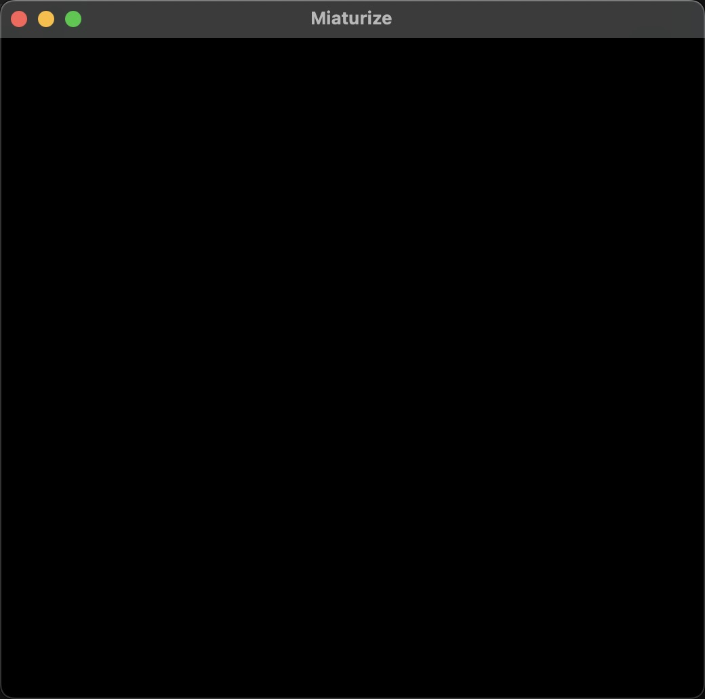

# Miaturize

Author: Messi Tu

Design: Sorry, I was not able to implement the gameplay because of stucking at the asset pipeline.

Screen Shot:

How Your Asset Pipeline Works:

My asset pipeline intends to load a png of size 128 x 96 pixels (16 x 12 tiles), and store these tiles and palettes in tile_table and palette table. However, when I use these tiles to draw the background, the background was all black. I tried to understand what was going on but unfortunately no clue by the due date.

How To Play:

Sorry, no game implemented.

This game was built with [NEST](NEST.md).

